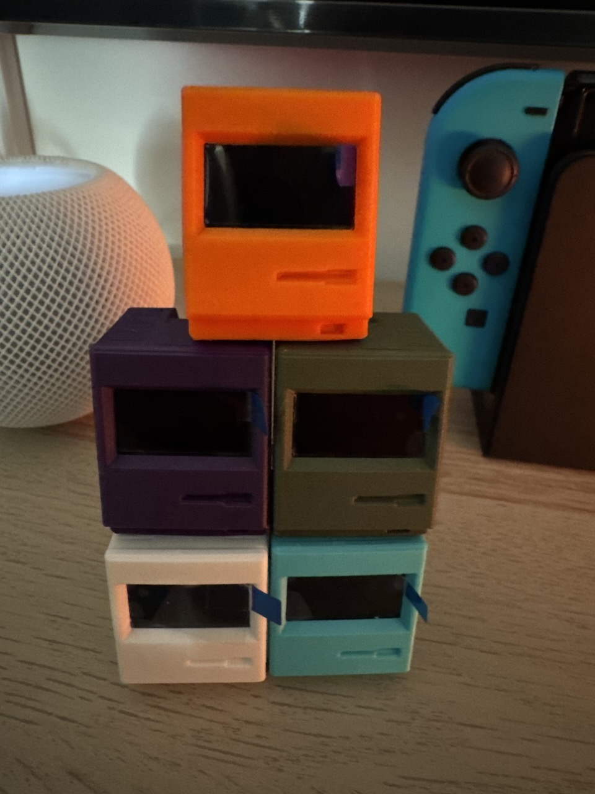
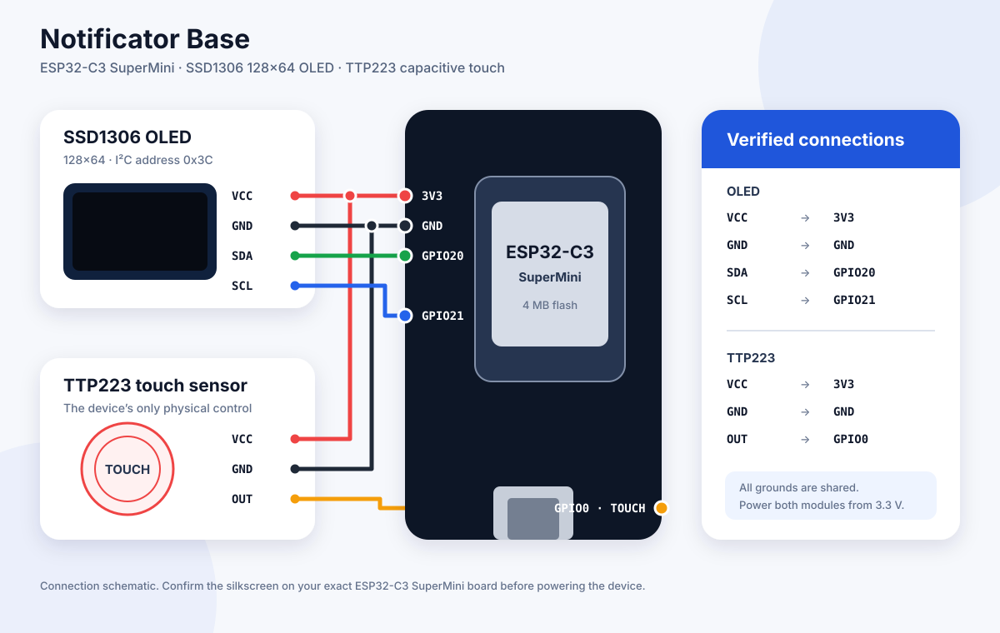

# Notificator Project IoT Firmware

[](https://www.apache.org/licenses/LICENSE-2.0)

This repository is the home of firmware for official Notificator hardware
models. **Notificator Base** is the stable target and **Notificator Touch 3.49**
is in active hardware and interface development. Future hardware, including
**Notificator Matter**, will use independent builds and release channels.

**[Open the firmware web installer](https://notificator-project.github.io/IoT-Firmware/)**

The firmware is configurable locally, so Wi-Fi and HiveMQ credentials do not
need to be committed to this public repository. OTA releases are authenticated
with a public verification key; the private release key remains outside the
repository.

Repository layout:

```text
models/
  notificator_base/                 ESP32-C3 OLED firmware target
  notificator_touch_349/            ESP32-S3 touch firmware target
  notificator_touch_349_diagnostic/ Hardware-validation target
  notificator_matter/               Reserved for the future Matter target
hardware/
  notificator_base/       Wiring and enclosure references
installer/                Browser-based USB firmware installer
scripts/                  Release and installer assembly helpers
```

Each production model owns its hardware definition, build dependencies, embedded OTA
verification key, and release artifacts. Code should move into a shared module
only after two model implementations genuinely use it.

## Supported firmware models

| Model | Hardware | Status | Version | OTA channel |
| --- | --- | --- | --- | --- |
| Notificator Base | ESP32-C3 SuperMini, SSD1306 OLED, TTP223 touch | Stable | `1.2.2` | `stable` |
| Notificator Touch 3.49 | Waveshare ESP32-S3 Touch LCD 3.49 | Preview | `0.9.3` | `preview` |
| Notificator Matter | To be announced | Planned | — | — |

Production sketches:

- `models/notificator_base/notificator_base.ino`
- `models/notificator_touch_349/notificator_touch_349.ino`

Touch has its own [model README](models/notificator_touch_349/README.md) with
board controls, setup behavior, UI details, and build settings.

For the source boundaries, runtime flow, MQTT contract, stored configuration,
OTA security model, and release checklist, see [ARCHITECTURE.md](ARCHITECTURE.md).

## What This Firmware Does

The models share the same secure MQTT and signed OTA contract while retaining
hardware-specific interfaces. Base uses a compact OLED and capacitive gesture
control. Touch uses a 640 × 172 capacitive display, audio output, orientation
sensing, an on-device Wi-Fi keyboard, and clock/weather modes.

Core capabilities:
- Connects to Wi-Fi using a setup portal (WiFiManager).
- Connects securely to a user-owned HiveMQ Cloud cluster.
- Stores recent message history in device preferences (ring buffer).
- Shows idle screens, connection state, unread counts, and a paged message viewer.
- Uses touch-first notification gestures.
- Supports model-specific, signed HTTPS OTA releases with progress and MQTT status reporting.

## Notificator Base hardware

Designed for:
- ESP32-C3 SuperMini
- SSD1306 OLED (128x64, I2C, address `0x3C`)
- TTP223 capacitive touch sensor

## Notificator Touch 3.49 hardware

Designed for the
[Waveshare ESP32-S3 Touch LCD 3.49](https://www.waveshare.com/esp32-s3-touch-lcd-3.49.htm):

- ESP32-S3 with 16 MB flash and octal PSRAM
- 3.49-inch 172 × 640 capacitive touch display
- ES8311 audio codec and onboard speaker path
- QMI8658 orientation sensor
- Battery input and physical BOOT, power, and reset controls

Touch is a preview target. Its signed OTA releases use a separate channel so
they cannot be selected by Base devices.

## Notificator Base enclosure

Notificator Base enclosures are 3D printed using a [Bambu Lab](https://bambulab.com) printer and [Bambu Lab PLA](https://bambulab.com/en/filament) filament.

The photo below shows color variants from the first community batch.



Devices from the first community batch were shipped free to selected community members.

Case design attribution:
- Designer: Uladzimir Hitsarau
- Model page: https://makerworld.com/en/models/2270326-tinytosh-mini-retro-pc-smart-wifi-display-esp32

PLA sustainability notes:
- PLA is commonly made from renewable plant-based feedstocks (for example, corn starch or sugarcane).
- It generally prints at lower temperatures than many petroleum-based filaments, which can reduce printing energy demand.
- While often described as biodegradable, PLA usually requires specific industrial composting conditions; it does not reliably break down quickly in normal household environments.
- To improve sustainability in practice, minimize failed prints, reuse prototypes when possible, and use local recycling/composting programs where accepted.

## GPIO / Wiring Reference

Based on the current firmware pin definitions:



The diagram is a connection schematic, not a substitute for the silkscreen on
your exact ESP32-C3 SuperMini revision. GPIO numbering in this README and the
firmware remains the source of truth.

- OLED SDA -> GPIO20
- OLED SCL -> GPIO21
- TTP223 digital output -> GPIO0

Firmware constants:
- `I2C_SDA = 20`
- `I2C_SCL = 21`
- `TTP223_PIN = 0`
- `OLED_ADDR = 0x3C`
- `OLED_WIDTH = 128`
- `OLED_HEIGHT = 64`

## Gesture Controls

The TTP223 is the device's only control:

- 1 tap: wake the display or show the next notification
- 2 taps: toggle the current notification read/unread
- 3 taps: open the rotating device and connection information screen
- 1 tap on the information screen: close it
- Hold for at least 1.8 seconds: mark all notifications read
- Hold for at least 6 seconds: open the setup portal

Destructive deletion is intentionally not assigned to a touch gesture. Clearing history remains available through the authenticated MQTT command flow.

Gesture timing constants:
- Tap window: `420 ms`
- Minimum press to count as tap: `25 ms`

## Setup Portal

If Wi-Fi or MQTT is not configured, or setup is triggered by a hold gesture, the device starts a branded local configuration portal. It configures:

- Wi-Fi network and password
- HiveMQ Cloud cluster hostname and secure MQTT port
- MQTT username and password
- Topic prefix

The portal uses WiFiManager for captive-network discovery and connection
handling, with an offline Notificator interface layered on top. Its landing page
separates device setup from technical information, broker settings are grouped
together, advanced network fields stay collapsed until needed, and the save
action shows immediate progress feedback. No remote fonts, scripts, or images
are required.

Notificator does not provide a shared or default MQTT broker. To receive device
notifications, you must connect your own HiveMQ Cloud cluster here. HiveMQ Cloud
is the only provider supported by the current firmware and plugin release.

HiveMQ offers a Serverless free plan with no credit card required, subject to
HiveMQ's current limits and terms:

1. Sign in at [HiveMQ Cloud](https://console.hivemq.cloud/) and choose
   **Create Serverless Cluster**.
2. Open the cluster overview and copy the generated cluster URL. Enter only its
   hostname in the device portal and WordPress.
3. Open **Access Management** and create a **Publish Only** credential for
   WordPress.
4. Create a separate **Publish and Subscribe** credential for the device.
5. Configure the same topic prefix in WordPress and on the device. New
   configurations default to `notificator-project`.

HiveMQ Cloud is an independent third-party service. Check its
[plan page](https://www.hivemq.com/products/mqtt-cloud-broker/) and
[official quick-start guide](https://docs.hivemq.com/hivemq-cloud/quick-start-guide.html)
for current limits, terms, and console instructions.

AP naming format:
- `WPNOTIF-<deviceId>`

After saving, the device subscribes to:

- `<topic-prefix>/<deviceId>/messages`
- `<topic-prefix>/<deviceId>/cmd`

It publishes retained device and OTA status to:

- `<topic-prefix>/<deviceId>/status`

Base and Touch refresh the retained online status every 60 seconds and register
a retained offline Last Will with HiveMQ. This allows the mobile app to detect
unexpected power or network loss without requiring the device to send a final
message itself.

The default topic prefix for new configurations is `notificator-project`.
Devices with a saved prefix keep their existing value. Credentials are stored
in the ESP32's local NVS preferences, and saved passwords are never echoed into
the portal.

## Network and Privacy Notes

Notifications, commands, and device status use the HiveMQ broker configured by
the device owner. Weather-capable idle themes use IP-based approximate location
and Open-Meteo forecast requests. A manually configured weather location avoids
the IP-location lookup. See [ARCHITECTURE.md](ARCHITECTURE.md#external-network-requests)
for the complete request and data-flow inventory.

## Display Improvements

- The status row distinguishes MQTT ready/waiting state and shows the unread count.
- Notification headers show the current history position, for example `2/7`.
- Titles use larger type when space allows.
- Detail text uses a denser four-line layout and paginates longer content.
- Read/unread actions show short confirmation screens.
- The information screen alternates between device/firmware details and live Wi-Fi/MQTT state.
- OTA progress and failures remain visible on the OLED.

## OTA Layout and Migration

The model directory includes `partitions.csv`, a 4 MB dual-OTA layout with two `0x1E0000` application slots. The firmware does not use a flash filesystem, so that space is reserved for reliable A/B application updates.

For a new device, or a device still using the older partition table, perform one USB flash of the complete build. A normal application-only OTA update cannot safely rewrite the flash partition table. After this one-time migration, future firmware binaries can use the signed HTTPS OTA flow.

## Browser Installer

The repository includes a catalog-driven [firmware web installer](installer/)
powered by ESP Web Tools. It flashes the complete merged factory image, including
the bootloader and partition table, so it can initialize a blank compatible
device or recover one that cannot use OTA.

The installer requires:

- A desktop version of Chrome or Edge with Web Serial support
- An HTTPS-hosted installer page
- A USB data cable
- A supported ESP32 board matching the selected firmware

A browser installation erases saved device configuration. After installation,
open the local `WPNOTIF-<deviceId>` setup network and enter Wi-Fi and HiveMQ
details again. Once setup is complete, future releases should normally be
installed through the firmware's authenticated OTA flow.

GitHub Actions compiles Base and Touch, verifies their complete merged images,
assembles the two-model installer, and deploys it to GitHub Pages. Generated
binaries remain build artifacts and are not committed to the source repository.

To prepare the installer locally after building both models:

```bash
scripts/prepare-web-installer.sh \
  build/notificator-base/notificator_base.ino.merged.bin \
  build/notificator-touch-349/notificator_touch_349.ino.merged.bin \
  build/web-installer
```

Firmware choices are defined in `installer/firmware-catalog.json`. Each choice
points to an ESP Web Tools manifest in `installer/manifests/`, making additional
models and release channels independently selectable.

In Arduino IDE use:

1. Board: **ESP32C3 Dev Module**
2. Flash size: **4 MB**
3. Partition scheme: **Minimal SPIFFS (1.9 MB APP with OTA)**
4. USB CDC on boot: **Enabled**

The local `partitions.csv` replaces the SPIFFS table during the build, while the IDE selection supplies the correct application-size check.

Official releases require no per-device OTA configuration. The firmware embeds
the official manifest URL and an ECDSA P-256 public key. A channel-based update
command causes the device to authenticate the manifest, require a compatible
model and board, stream the image into the inactive slot, and verify its
SHA-256 digest before activation. Unless an authenticated command explicitly
uses `force`, the release version must be newer than the running firmware.

## Software Requirements

To build in Arduino IDE or PlatformIO, you need:
- ESP32 Arduino core
- WiFiManager
- PubSubClient
- ArduinoJson
- Adafruit GFX Library
- Adafruit SSD1306
- LVGL 9.3.0 for Notificator Touch

Arduino CLI example:

```bash
arduino-cli compile \
  --fqbn "esp32:esp32:esp32c3:CDCOnBoot=cdc,PartitionScheme=min_spiffs,FlashSize=4M" \
  --output-dir build/notificator-base \
  models/notificator_base

arduino-cli compile \
  --fqbn "esp32:esp32:esp32s3:USBMode=hwcdc,CDCOnBoot=cdc,FlashSize=16M,PartitionScheme=app3M_fat9M_16MB,PSRAM=opi,FlashMode=qio" \
  --output-dir build/notificator-touch-349 \
  models/notificator_touch_349
```

Publish compiled binaries as release artifacts rather than committing generated
build output. OTA manifest entries and URLs must always use the corresponding
model ID and board ID.

To publish an official version, update the source and installer metadata, then
publish a model-prefixed GitHub release:

- Base: `base-vX.Y.Z`
- Touch: `touch-vX.Y.Z`

Legacy `vX.Y.Z` tags remain supported as Base releases. The firmware workflow
compiles both models, deploys the web installer, and attaches the selected
model's versioned OTA and factory binaries to the release. The private API
repository's manually started
**Publish signed firmware** workflow then downloads that OTA asset and signs
the public release manifest inside its protected `firmware-production`
environment. The private signing key never belongs in this repository.

The firmware is split by responsibility:

- `models/notificator_base/notificator_base.ino` owns the Notificator Base hardware and runtime state machines.
- `models/notificator_base/ota_release_config.h` contains the model identity, official manifest URL, and public verification key.
- `models/notificator_base/ota_security.h` and `models/notificator_base/ota_security.cpp` contain testable version and signature-verification helpers.
- `models/notificator_base/portal_ui.h` contains the compact, offline-safe setup portal presentation.
- `models/notificator_base/partitions.csv` defines the dual-slot OTA flash layout.

This deliberately avoids a large refactor of the timing-sensitive OLED, touch,
and MQTT paths before they have been validated together on physical hardware.

## Configuration Notes

On first boot, configure the HiveMQ connection in the local setup portal.
Official OTA updates require no device-specific update secret or hostname.
Firmware `1.2.0` is the minimum version accepted by the device API. Older
devices can receive an authenticated OTA command, but ordinary commands and
MQTT notification delivery remain blocked until the device reports `1.2.0` or
newer.

## Version info

Current Base metadata:
- Model name: `Notificator Base`
- Model ID: `notificator_base`
- Board ID: `esp32c3-supermini-oled`
- Firmware name: `Notificator Base Firmware`
- Firmware version: `1.2.2`
- Firmware date: `2026-08-06`

Current Touch metadata:

- Model name: `Notificator Touch 3.49`
- Model ID: `notificator_touch_349`
- Board ID: `waveshare-esp32-s3-touch-lcd-3.49`
- Firmware version: `0.9.3 Preview`

## License

This project is licensed under the Apache License 2.0. See [LICENSE](LICENSE) for details.
